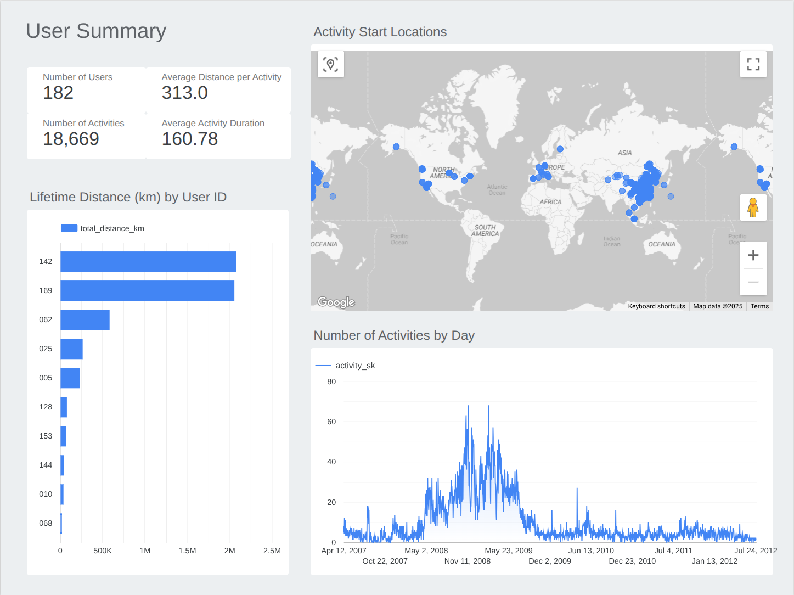
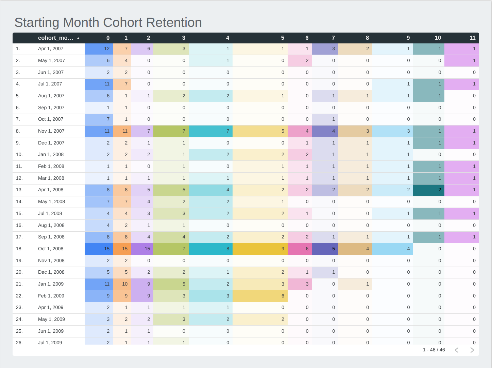

# End-to-End Data Analytics Project: GeoLife GPS Trajectory Analysis

This repository contains the full code and documentation for a data engineering and analytics project designed to showcase a modern data stack workflow. The project ingests raw GPS trajectory data, processes it with a serverless cloud function, models it using dbt, and visualizes the results in Looker Studio.

### 📊 [View the Live Looker Studio Dashboard](https://lookerstudio.google.com/reporting/4e8c2298-48e3-4f69-9f5b-e1176bf505bc/page/y3PTF)

---

## Table of Contents
- [Project Overview](#project-overview)
- [Tech Stack & Architecture](#tech-stack--architecture)
- [Data Pipeline](#data-pipeline)
- [dbt Project Structure](#dbt-project-structure)
- [Key Analytical Findings](#key-analytical-findings)
- [How to Run This Project](#how-to-run-this-project)
- [Future Work](#future-work)

---

## Project Overview

The goal of this project was to build a robust, scalable, and automated data pipeline and analytics suite from scratch, following industry best practices. The project uses the [Microsoft GeoLife GPS Trajectory dataset](https://www.microsoft.com/en-us/research/publication/geolife-gps-trajectory-dataset-user-guide/) to analyze user activity patterns.

This project was developed to demonstrate proficiency in the core tools of the modern data stack for a Data Analyst role. It answers business questions a Product or Growth Manager might ask, such as:
- What are our core user engagement metrics?
- Where are our most active users located?
- How well do we retain new users over time?

---

## Tech Stack & Architecture

This project utilizes a serverless, cloud-native architecture on Google Cloud Platform, designed for scalability and low maintenance.

* **Cloud Provider:** Google Cloud Platform (GCP)
* **Data Lake:** Google Cloud Storage (GCS)
* **Data Ingestion:** Cloud Run functions
* **Data Warehouse:** Google BigQuery
* **Data Transformation:** dbt
* **Data Visualization:** Google Looker Studio
* **Version Control:** Git

### Architecture Diagram


---

## Data Pipeline

The data ingestion process is fully automated and event-driven:

1.  **Trigger:** Raw `.plt` trajectory files are uploaded to a GCS bucket (`ms-geolife-raw-data-eu`).
2.  **Processing:** A Python Cloud Function is automatically triggered by the file upload. The function is designed to be memory-efficient, processing even very large files in batches.
3.  **Race Condition Handling:** The function includes logic to handle race conditions during initial table creation, ensuring that hundreds of parallel invocations do not cause errors.
4.  **Loading:** The Python function parses the files, adds metadata like `user_id` and `activity_id`, and streams the data into a raw BigQuery table (`geolife_raw.geolife__activities`).

The Python script for this process is available in the `ingestion_scripts/` directory for reference.

---

## dbt Project Structure

The dbt project transforms the raw, point-in-time GPS data into a clean, easy-to-use set of analytical models using a layered, best-practice approach.

* **Sources (`sources.yml`):** The raw BigQuery table is defined and documented as a source.
* **Staging Models (`stg_`):** These models perform basic cleaning, renaming, and casting on the raw data. Outlier records (e.g., with invalid GPS coordinates) are filtered out here.
* **Intermediate Models (`int_`):** This layer handles complex transformations. `int_activities_with_distance.sql` uses BigQuery's geospatial functions to calculate the distance between each consecutive GPS point.
* **Mart Models (`fct_`, `dim_`, presentation):** These are the final, business-facing models that power the Looker Studio dashboards.
    * `fct_activities`: A fact table with one row per completed activity, summarizing key metrics. A surrogate key (`activity_sk`) is generated to uniquely identify each activity.
    * `dim_users`: A dimension table with one row per user, summarizing their lifetime activity.
    * `fct_user_retention` & `retention_cohorts_pivoted`: A set of modular models that calculate user retention cohorts, with the final model pre-pivoted for maximum performance in the BI tool.

The project makes extensive use of **dbt tests** to ensure data quality. This includes a **custom generic test** (`assert_valid_coordinates`) and tests from packages like `dbt_expectations`.

---

## Key Analytical Findings

### User Engagement Insights
* The dataset contains 182 unique users who logged over 18,000 activities. The average activity was 313 km long and lasted 161 minutes. The Bubble Map shows a high concentration of activity in Asia, and in particular the Beijing area, as expected from the dataset's origin.
* An interesting finding is that the top 2 users by distance travelled did not rank as high by number of activities, but had extremely long-distance activities. When mode of transport data is added down the line, this may add some clarity to why.


### User Retention Insights
* For the first 22 months, from April 2007 until February 2009, there was relatively similar uptake of new joiners to the program. There appeared to be a slight reduction in those who continued to track towards the end of this period.
* From April 2009, user sign-up significantly dropped off, and so did monthly consistency. We see an outlier month in September 2009 with 9 new sign-ups, but only one user recorded an activity the next month, and none were recorded by any in that cohort for the remainder of the year.

---

## How to Run This Project

1.  Clone this repository.
2.  Set up your own Google Cloud Platform project with BigQuery and Cloud Storage enabled.
3.  Follow the instructions in `ingestion_scripts/README.md` to deploy the Cloud Function.
4.  Configure your dbt `profiles.yml` file to connect to your BigQuery project.
5.  From the dbt project root, run the following commands:
    ```bash
    dbt deps  # Install dbt packages
    dbt run   # Build all models
    dbt test  # Run all data quality tests
    ```
---

## Future Work
* Enrich the `fct_activities` model to infer activity type (e.g., walking, cycling, driving) based on average speed.
* Build a model to identify suspicious running activities.
* Set up a CI/CD pipeline using GitHub Actions to automatically run dbt models and tests on a schedule.
* Perform geospatial analysis to identify the most popular activity routes.